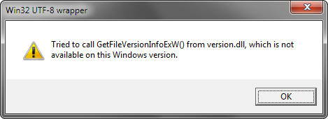

Win32 UTF-8 wrapper
-------------------

### Why a wrapper? ###

This library evolved from the need of the [Touhou Community Reliant Automatic Patcher](https://github.com/thpatch/thcrap) to hack Unicode functionality for the Win32 API into games using the ANSI functions.

By simply including `win32_utf8.h` and linking to this library, you automatically have Unicode compatibility in applications using the native Win32 APIs, usually without requiring changes to existing code using char strings.

### Extended functionality ###

In addition, this library also adds new useful functionality to some original Windows functions.

###### kernel32.dll ######

* `CreateDirectoryU()` works recursively - the function creates all necessary directories to form the given path.
* `LoadLibraryExU()` can be safely and unconditionally used with the search path flags introduced in [KB2533623](https://support.microsoft.com/help/2533623/). If this update is not installed on a user's system, these flags are cleared out automatically.
* `GetModuleFileNameU()` returns the necessary length of a buffer to hold the module file name if NULL is passed for `nSize` or `lpFilename`, similar to what `GetCurrentDirectory()` can do by default.

###### shell32.dll ######

* `SHBrowseForFolderU()` always displays an edit box and shows a resizable window if the active thread's COM settings allow it.

###### shlwapi.dll ######

* `PathRemoveFileSpecU()` correctly works as intended for paths containing forward slashes

#### UTF-8 versions of functions that originally only have UTF-16 versions

* `LPSTR* WINAPI CommandLineToArgvU(LPCWSTR lpCmdLine, int* pNumArgs)`

	Splits a UTF-16 command-line string (returned by e.g.`GetCommandLineW()`) into an UTF-8 `argv` array, and returns the number of arguments (`argc`) in `pNumArgs`. The caller has to free the returned array using `LocalFree()`.

* `HRESULT WINAPI SHParseDisplayNameU(LPCSTR pszName, IBindCtx *pbc, LPITEMIDLIST *ppidl, SFGAOF sfgaoIn, SFGAOF *psfgaoOut)`

	Converts a path (`pszName`) to a `ITEMLIST` pointer (`ppidl`), required for a number of shell functions. Unlike the original function, this wrapper also works as expected for paths containing forward slashes.

### OS compatibility
win32_utf8 it meant to require at least Windows XP - that is, it statically references only Windows functions that were available on XP. Wrappers for functions that were introduced in later Windows versions load their original functions dynamically using GetProcAddress().

As a result, these wrappers themselves are not tied to the minimum required OS of the function they wrap. This means that applications which call these wrappers will actually *start* on Windows XP and *not* abort with the classic *"The procedure entry point X could not be located in the dynamic link library Y.DLL."* error on startup. (Unless, of course, if your compiler would target a newer Windows version anyway.) However, the wrappers will show this message box on every call:



This is arguably preferable over the three other options for dealing with this issue (just crashing by calling a NULL pointer, silently doing nothing, or aborting on startup with the aforementioned error). It should still run the majority of the program, and it provides a helpful message during testing - which can even be left in shipping builds as a sort of nag screen for end users that still use old Windows versions.

The following functions are wrapped in this way:

 * version.dll
	 * GetFileVersionInfoSizeEx()
	 * GetFileVersionInfoEx()

### Building ###
* Replace all inclusions of `windows.h` or `stdio.h` with `win32_utf8.h` in your existing native Win32 code.
* If your program is a standalone executable and not a (static or dynamic) library, see the [Custom `main()` function](#custom-main-function) section for details on how to get UTF-8 command-line parameters in `argv`.

The rest differs between static and dynamic linking:

#### Static linking ####
Make sure that `win32_utf8_build_static.c` is compiled as part of your sources.

If your codebase doesn't necessarily need to use all of the wrapped functions (which is probably the case for most programs), you may additionally `#define WIN32_UTF8_NO_API`. This macro removes the `w32u8_get_wrapped_functions()` function, which references all wrapped functions that are part of win32_utf8, from your build. This aids the elimination of unused wrapper functions (and their DLL references) with some compilers, particularly Visual C++.

#### Dynamic linking ####
For dynamic linking or other more special use cases, a project file for Visual C++ is provided. The default configuration requires the Visual Studio 2013 platform toolset with Windows XP targeting support, but the project should generally build under every version since Visual C++ 2010 Express after changing the platform toolset (*Project → Properties → General → Platform Toolset*) to a supported option.

To generate a DLL in a different compiler, simply compile `win32_utf8_build_dynamic.c`.

#### Custom `main()` function ####
Together with win32_utf8's entry point wrappers, changing the name and parameter list of your `main()` or `WinMain()` function to

```c
int __cdecl win32_utf8_main(int argc, const char *argv[])
```

guarantees that all strings in `argv` will be in UTF-8. `src/entry.h`, which is included as part of `win32_utf8.h`, redefines `main` as `win32_utf8_main` and thereby eliminates the need for another preprocessor conditional block around `main()` in cross-platform console applications.

You then need to provide the *actual* entry point by compiling the correct `entry_*.c` file from this repository as part of your sources:
* `entry_main.c` if your program runs in the console subsystem.
* `entry_winmain.c` if your program runs in the graphical Windows subsystem and should not open a console window. Requires `-mwindows` on GCC.

It can either be a separate translation unit, or `#include`d into an existing one. Also, make sure that your compiler's subsystem settings match the entry point file.

#### Compiler support ####
**Visual C++** and **MinGW** compile the code just fine. Cygwin is not supported, as [it lacks Unicode versions of certain C runtime functions because they're not part of the POSIX standard](https://www.cygwin.com/ml/cygwin/2006-03/msg00539.html). (Of course, using MinGW's `gcc` through Cygwin works just fine.)
